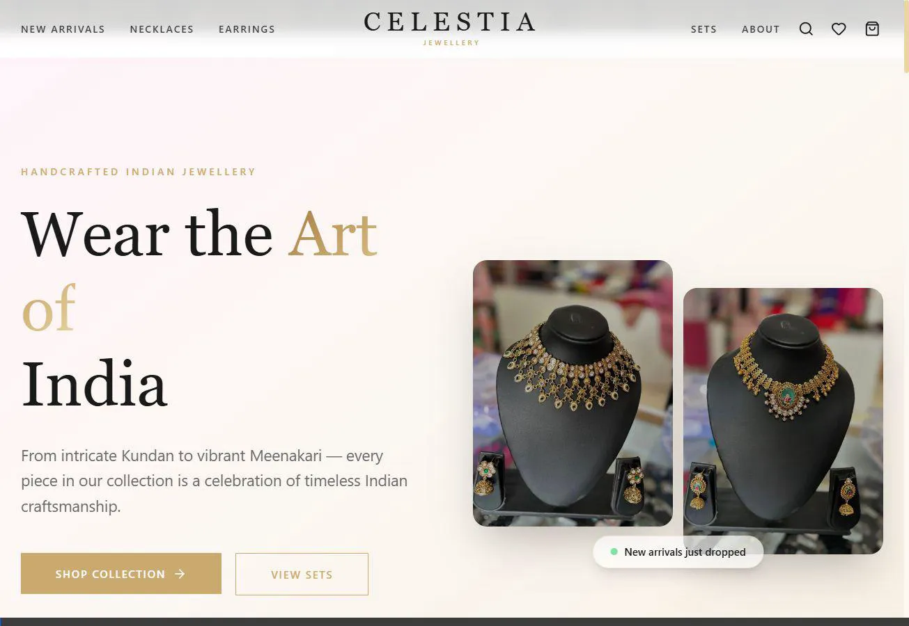
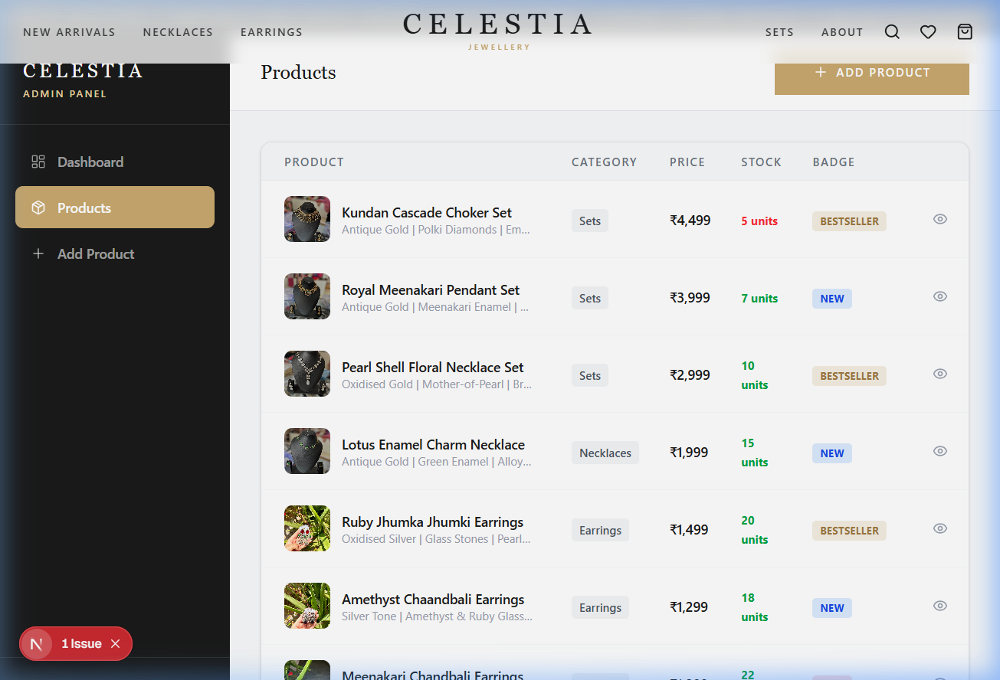

# Celestia | Luxury Handcrafted Jewellery Store

[](https://celestiajwels.vercel.app/)
[](https://nextjs.org/)
[](https://tailwindcss.com/)
[](https://www.typescriptlang.org/)
[](https://www.framer.com/motion/)

A premium, high-end e-commerce platform built for **Celestia** (fine jewellery). Inspired by the aesthetics of modern luxury stores like Palmonas, the application leverages Next.js App Router, Tailwind CSS v4, and Framer Motion to deliver a smooth, high-fidelity user experience featuring a **"Liquid Glass"** visual theme, comprehensive shopping cart management, interactive size guides, a secure checkout simulator, and a dedicated, password-gated admin inventory controller.

---

## 📖 Table of Contents
* [Key Features](#-key-features)
* [Design & Visual Language](#-design--visual-language)
* [Screenshots & Walkthrough](#-screenshots--walkthrough)
* [Tech Stack](#-tech-stack)
* [Directory Structure](#-directory-structure)
* [Installation & Local Setup](#-installation--local-setup)
* [Headless Architecture & Shopify Sync](#-headless-architecture--shopify-sync)
* [Admin Portal Credentials](#-admin-portal-credentials)
* [Deployment](#-deployment)

---

## ✨ Key Features

### 🛍️ Client Storefront
* **Luxury Homepage**: An immersive landing page containing a high-contrast hero banner, smooth auto-scrolling ticker bands, categorized product collections (Sets, Earrings, etc.), brand values, and responsive customer feedback marquees.
* **Unified Shop Catalog**: A dynamic shop grid showing items with categories, real-time client-side filter sorting (such as pricing from low-to-high, high-to-low), and stock availability checks.
* **Product Details Page**: Multi-image product carousels accompanied by detailed spec accordions (materials, dimensions, styling notes, and care instructions), ratings, and intelligent recommendations for related designs.
* **Interactive Sizing Calculator**: An on-page modal tool simulating size recommendations for rings, bracelets, and necklaces to improve purchase conversion.
* **Shopping Cart Drawer**: A slide-out panel allowing real-time basket adjustments (additions, removals, and count modifications) persisting directly via browser local storage.
* **Secure Checkout Flow**: A multi-step simulated checkout (Order Review $\rightarrow$ Shipping Coordinates $\rightarrow$ Payment Choice) culminating in a unique order reference completion screen.

### 🔐 Admin Inventory Management Suite
* **Password Gated Security**: Accessible via a custom secure entrance protecting dashboard endpoints from unauthorized visitors.
* **Live Catalog Insights**: Aggregated dashboards showing total inventory value, item stock volumes, and category distributions.
* **Product CRUD Panel**: Ability to instantly add, modify, update (pricing, descriptions, badges, image paths, materials), flag as "featured," or remove items directly within the client viewport.

---

## 🎨 Design & Visual Language

The project implements the premium **"Liquid Glass"** UI pattern, featuring:
* **Color Palette**: Sophisticated dark charcoal background, champagne gold highlights (`#d4af37`), muted ivory tones, and translucent glassmorphism gradients.
* **Typography**: Elegant `Cormorant Garamond` serif headings paired with clean `Montserrat` sans-serif body text.
* **Animations**: Powered by Framer Motion, utilizing soft fade-ins, sliding panels, hover scaling, and ticker tracks.

---

## 📸 Screenshots & Walkthrough

### Storefront Experience
The storefront features high-fidelity, liquid-glass visual components and champagne-gold highlighting.


### Admin Operations
Manage your inventory in real-time. Simply use the admin password to login.


---

## 🛠️ Tech Stack

* **Framework:** [Next.js App Router](https://nextjs.org/) (Server-Side Rendering & Hydrated Client components)
* **Styling:** [Tailwind CSS v4.0](https://tailwindcss.com/) (using native CSS custom properties for styling tokens)
* **Interactions:** [Framer Motion](https://www.framer.com/motion/) for fluid animations
* **Icons:** [Lucide React](https://lucide.dev/) for vector assets
* **State Management:** React Context API + LocalStorage persistence

---

## 📂 Directory Structure

```text
celestia/
├── public/                 # Static assets (Seeded jewellery images & walkthroughs)
│   ├── images/
│   └── screenshots/
├── src/
│   ├── app/                # Pages Router / Next.js Routing
│   │   ├── admin/          # Admin dashboard & analytics pages
│   │   ├── checkout/       # Multi-step checkout pipeline
│   │   ├── product/[id]/   # Dynamic product detail route
│   │   ├── shop/           # Shop listings & collection catalog
│   │   ├── globals.css     # Global styles & design system definitions
│   │   └── page.tsx        # Storefront index homepage
│   ├── components/         # Modular React Components
│   │   ├── AnnouncementBar.tsx
│   │   ├── CartDrawer.tsx
│   │   ├── Footer.tsx
│   │   ├── InteractiveSizingModal.tsx
│   │   ├── NavBar.tsx
│   │   ├── NewsletterForm.tsx
│   │   └── ProductCard.tsx
│   └── lib/                # Core helper files & models
│       ├── cartContext.tsx # Dynamic cart context controller
│       └── products.ts     # In-memory database & storage handlers
├── package.json
└── tsconfig.json
```

---

## 🚀 Installation & Local Setup

### Prerequisites
* [Node.js](https://nodejs.org/) (v18.0.0 or higher recommended)
* [npm](https://www.npmjs.com/) or another package manager of your choice

### Setup Steps
1. Clone the project repository:
   ```bash
   git clone <repository-url>
   cd celestia
   ```
2. Install dependencies:
   ```bash
   npm install
   ```
3. Run the hot-reloading development server:
   ```bash
   npm run dev
   ```
4. Access the store at [http://localhost:3000](http://localhost:3000).

### Build for Production
To optimize the codebase and run it in a production state:
```bash
npm run build
npm run start
```

---

## 🔒 Admin Portal Credentials

To test or manage products via the admin screen:
* **Admin Path:** `/admin`
* **Access Password:** `celestia@admin`

---

## 📦 Headless Architecture & Shopify Sync

Currently, Celestia runs on a headless, client-side repository system (`src/lib/products.ts`) enabling instant offline execution without external database setups. 

To link this frontend to a production **Shopify** store:
1. Update `src/lib/products.ts` functions (e.g., `getProducts`, `getProductById`) to connect to the Shopify **Storefront API** or **Admin API** via GraphQL/REST fetch requests.
2. Store your Shopify Access Tokens and Shop URL as Environment Variables (`.env.local`).

Example integration structure in `src/lib/products.ts`:
```typescript
export async function getProducts() {
  const response = await fetch('https://your-shop.myshopify.com/api/2023-07/graphql.json', {
    method: 'POST',
    headers: {
      'Content-Type': 'application/json',
      'X-Shopify-Storefront-Access-Token': process.env.SHOPIFY_STOREFRONT_TOKEN!,
    },
    body: JSON.stringify({ query: `{ products(first: 20) { edges { node { id title priceRange { minVariantPrice { amount } } } } } }` })
  });
  // Map standard Shopify response format to Product interface
}
```

---

## 🌐 Deployment

The codebase is structured to deploy smoothly on **Vercel** with zero-configuration:
1. Push your repository to GitHub, GitLab, or Bitbucket.
2. Link your Vercel account to the repository.
3. Keep default build commands and click **Deploy**. Vercel will automatically build the Next.js production build and serve it at a live URL (e.g., `https://celestiajwels.vercel.app/`).
